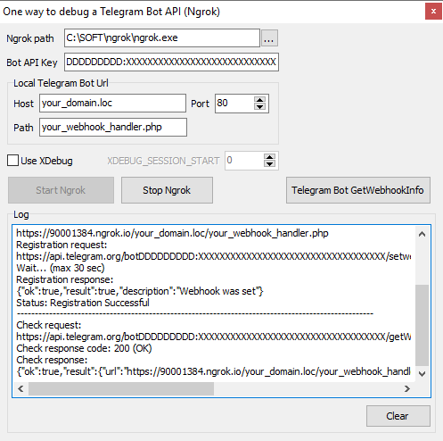
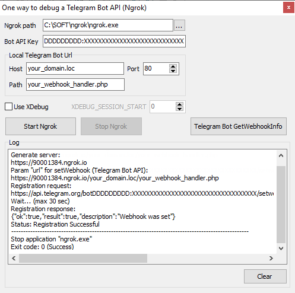

# OneWayDebug

One way to debug a Telegram Bot API.
You do not need a certificate for debugging.
The Ngrok service uses its certificate.

Instructions only for Windows.

Binary Downloads
- Ngrok <https://ngrok.com>
- OneWayDebug <https://ngrok.com>
- Download and install your favorite webserver. The webserver must be available locally.

# Run
    >OneWayDebug.exe
	
# The list of variables
* `Ngrok path` - Path to Ngrok.exe
* `Bot API Key` - Telegram Bot API Key (without prefix `bot`)
* `Host`, `Port`, `Path` - Local webserver settings
* `Use XDebug` for PhpStorm. If `Use XDebug` checked, then you need to set `XDEBUG_SESSION_START`
	
# Using
## OneWayDebug.exe

## Press button "Start Ngrok"

## Press button "Telegram Bot GetWebhookInfo"

## Send a message to the telegram channel

## Debug script `your_webhook_handler.php`

## Send response

## Press button "Stop Ngrok"

# Building project
Delphi 10 is required for building OneWayDebug.
https://www.embarcadero.com/products/delphi

**OneWayDebug uses Pipe components by Russell Libby.**
Author: Russell Libby, updated by Franзois PIETTE @ OverByte
Blog: Inter Process Communication Using Pipes <https://francois-piette.blogspot.com/search?q=pipe>

License
-------
OneWayDebug is OpenSource and released under GPL (GNU GENERAL PUBLIC LICENSE).
Probably OneWayDebug saved you a lot of time and you like it. In this case you may make a donation here.